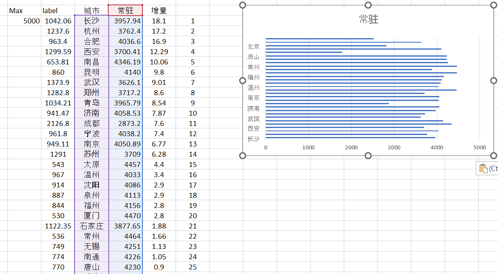
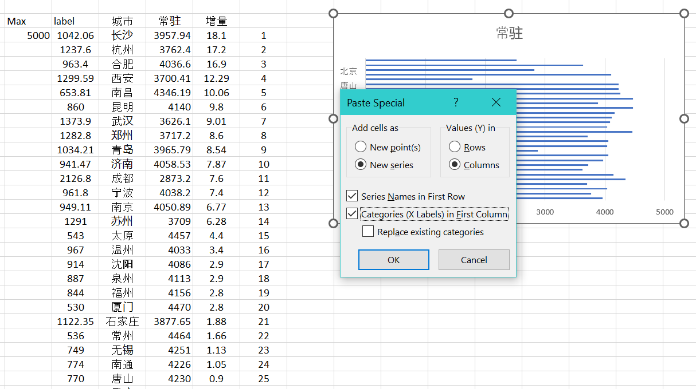
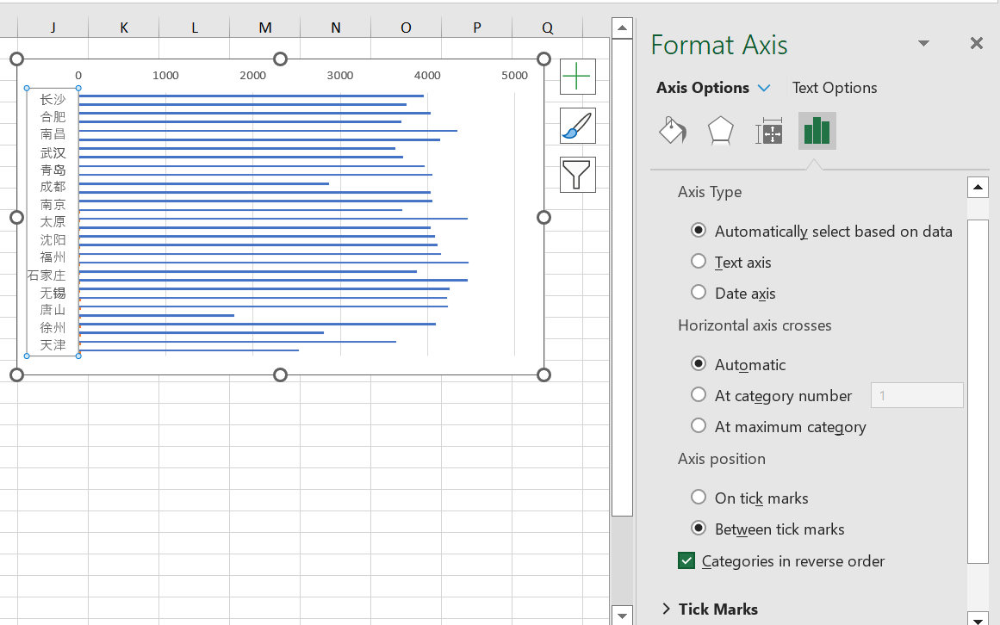
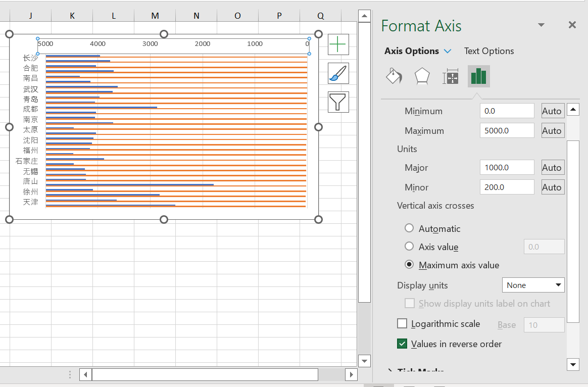
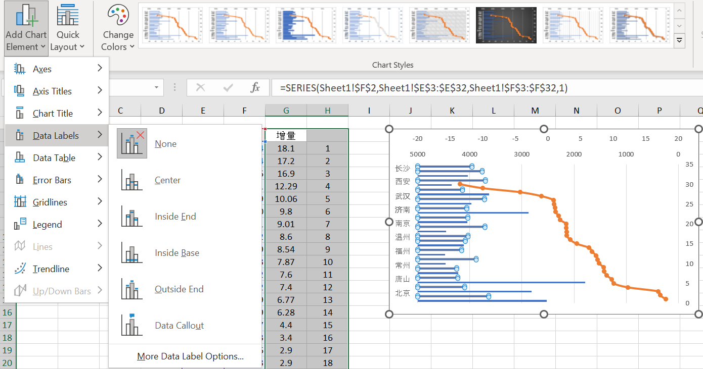
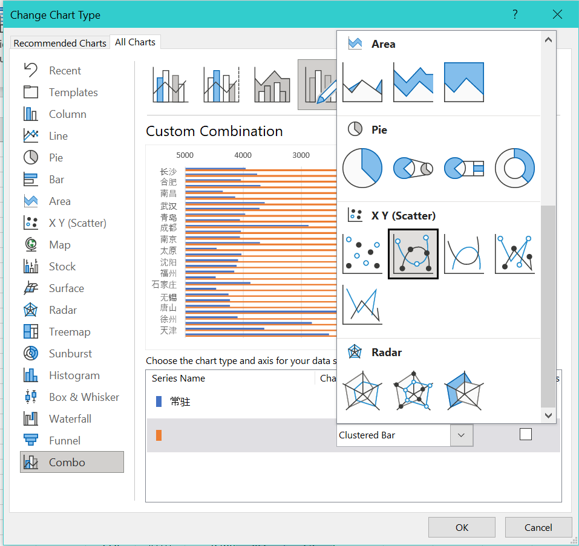
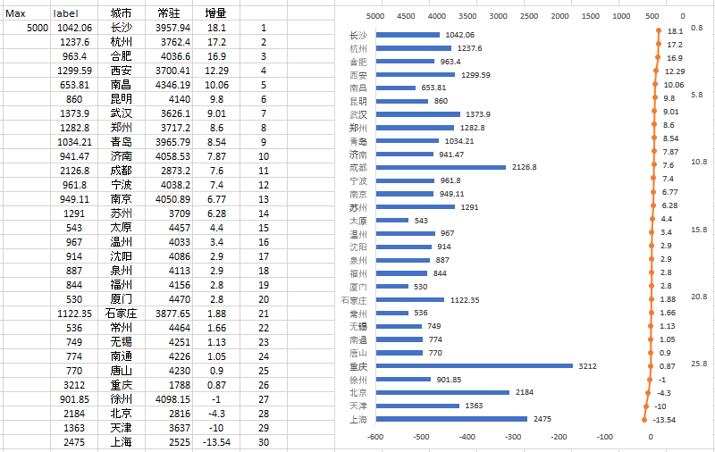
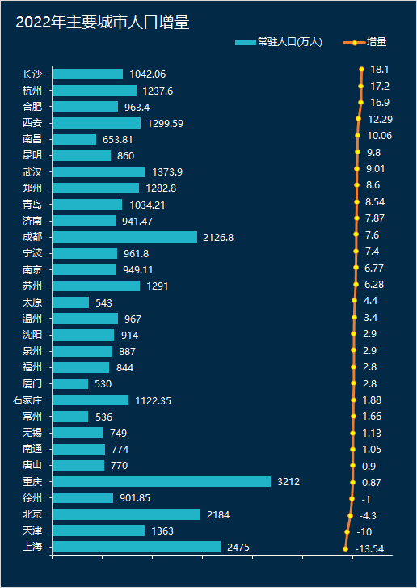

# How to make overlay line chart on top of a bar chart with Excel?

Yesterday, FW sent a chart from wechat, requested my help to recreate it in Excel.

The chart is a bit interesting, like a combo charts from bar and line.

2023 Apr 17, I finished the recreating.

## Changelog

* v0.01, empathy - define - ideate - prototype - test (iterate)
* v0.02, mechanism
* v0.03, initial build
* v0.04, fine-tuning

## Author

@ZL, 20230417

## Reference

source: <https://answers.microsoft.com/en-us/msoffice/forum/all/overlay-line-chart-on-top-of-stacked-bar-chart/3cfdf956-85eb-49b5-8bde-96311ad88cdc>

```html
See if this works for you:
1. Modify your data by adding a column as below
2. Make a bar chart using just the Items and Views columns.
3. Select the Interactions data and the data to the right of it.  Copy to the clipboard.
4. Select the chart and choose "Paste Special..."
5. Select "New Series", "Columns", "Series Names in First Row" and "Categories (X Labels) in First Column".  Click OK
6. Select the new series and change its type to "XY Scatter
7. Modify the Secondary Y axis (Categories) scale so that the scatter chart data points line up with the bars from the bar chart.
8. Right-click on each series and choose "Add Data Labels". On the Scatter chart series, right-click, select "Format Data Labels", and make sure "X Values" is selected and not "Y Values".
9. Now you should have something approximating what you want. Mess around with it to get it exactly right.
```

| items       | views   | interaction |         |
|-------------|---------|-------------|---------|
| Category 1  | 26%     | 3%          | 1       |
| Category 2  | 25%     | 7%          | 2       |
| Category 3  | 19%     | 5%          | 3       |
| Category 4  | 15%     | 5%          | 4       |
| Category 5  | 15%     | 8%          | 5       |

## Distill Mechanism

1. Combine bar chart with xy scatter chart in one.
2. Separate Bar chart series and data label, using some certain max value as baseline, 5000 in this case. Because X-axis value will be inverted.
3. Mess around xy scatter axis to match the original chart with secondary X-axis and Y-axis.

Max  |label   | 城市  | 常驻  | 增量    | 增量 |
-----|--------|-------|-------|--------|------|
5000 |1042.06 | 长沙  | 3957  | 18.1   | 1    |
5000 |1237.6  | 杭州  | 3762  | 17.2   | 2    |
5000 |963.4   | 合肥  | 4036  | 16.9   | 3    |
5000 |1299.59 | 西安  | 3700  | 12.29  | 4    |
5000 |653.81  | 南昌  | 4356  | 10.06  | 5    |

## Step by step

step 1. create a basic bar chart



step 2. copy scatter chart data series then paste into the basic bar chart



step 3. fix bar chart xy axises





step 4. attache data labels for both charts and fix scatter series data label



step 5. change the scatter data series to scatter chart



step 6. display secondary x-axis and fix scatter chart axises



step 7. style and polish

## Result



## About

MIT License

Copyright (c) 2023 ZL

Permission is hereby granted, free of charge, to any person obtaining a copy
of this software and associated documentation files (the "Software"), to deal
in the Software without restriction, including without limitation the rights
to use, copy, modify, merge, publish, distribute, sublicense, and/or sell
copies of the Software, and to permit persons to whom the Software is
furnished to do so, subject to the following conditions:

The above copyright notice and this permission notice shall be included in all
copies or substantial portions of the Software.

THE SOFTWARE IS PROVIDED "AS IS", WITHOUT WARRANTY OF ANY KIND, EXPRESS OR
IMPLIED, INCLUDING BUT NOT LIMITED TO THE WARRANTIES OF MERCHANTABILITY,
FITNESS FOR A PARTICULAR PURPOSE AND NONINFRINGEMENT. IN NO EVENT SHALL THE
AUTHORS OR COPYRIGHT HOLDERS BE LIABLE FOR ANY CLAIM, DAMAGES OR OTHER
LIABILITY, WHETHER IN AN ACTION OF CONTRACT, TORT OR OTHERWISE, ARISING FROM,
OUT OF OR IN CONNECTION WITH THE SOFTWARE OR THE USE OR OTHER DEALINGS IN THE
SOFTWARE.
